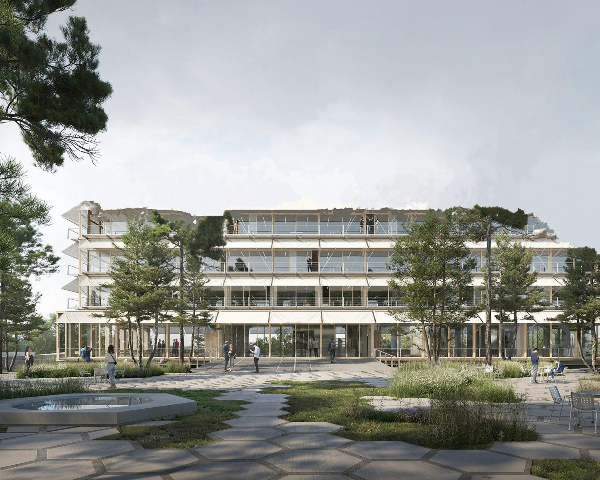
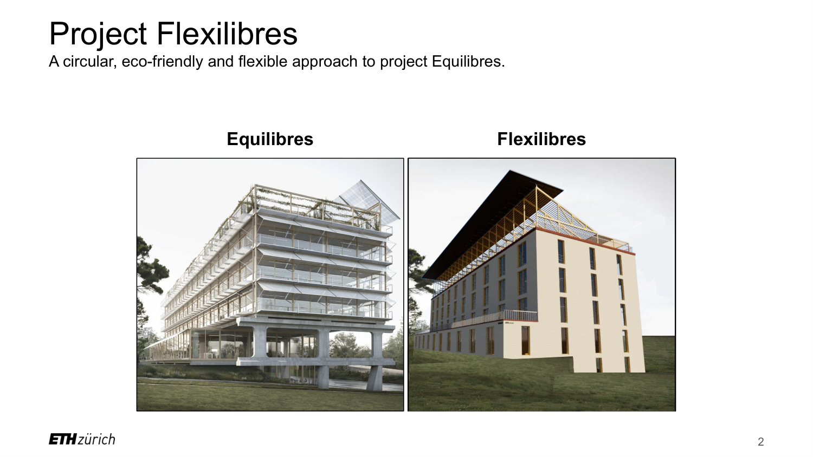
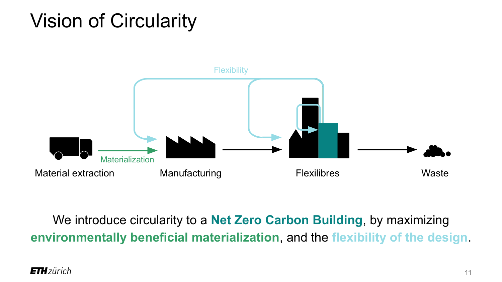
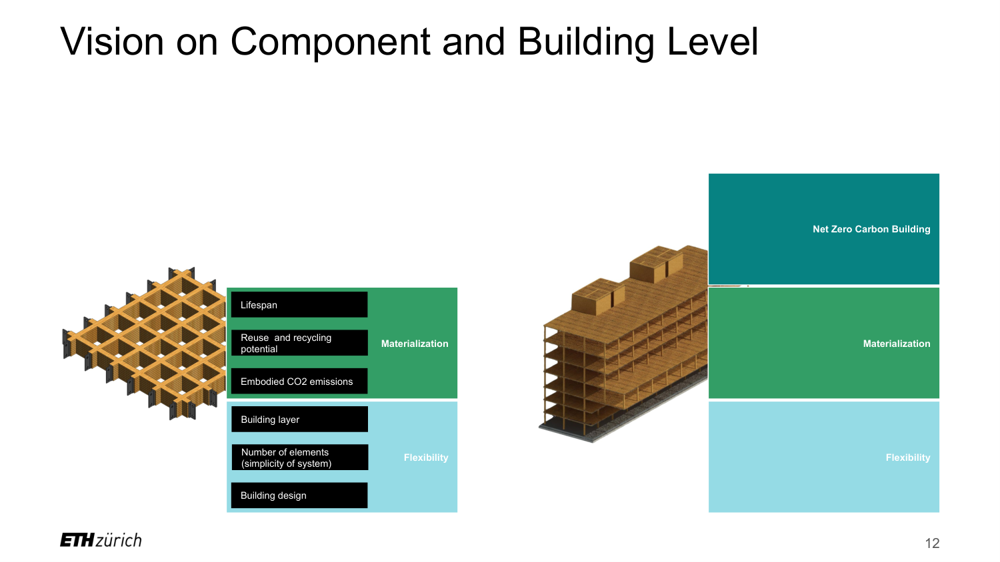
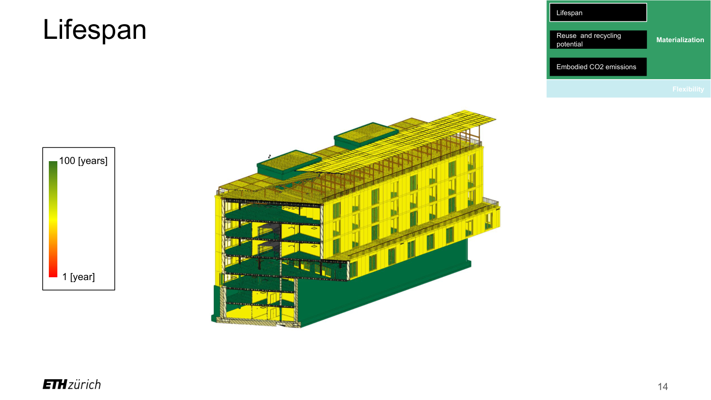

# Custom APS BIM Viewer

  

  <b>A web BIM viewer that puts a building's material passport onto its 3D model.</b> 
  <a href="https://custom-aps-bim-viewer.onrender.com"><b>&#9654; Open the live viewer</b></a>

---

## About the project

This viewer was built for **Flexilibres**, the final project of an **ETH Zürich** Master studio at the *Institut für Bau- und Infrastrukturmanagement* (Group 2, 2021). Flexilibres is a **circular, low-carbon and flexible** redesign of the existing *Equilibres* building: a timber primary structure that stores carbon, components designed to be reused and disassembled, and a layout that can adapt over the building's life. The aim was a **Net Zero Carbon Building**, reached by maximizing two levers, *materialization* (low-impact, reusable materials) and *flexibility* (a system that can change without being demolished).

  

## The idea: circularity as a design driver

Instead of the usual linear flow (extract, manufacture, build, then demolish to waste), Flexilibres closes the loop: materials and whole components can re-enter the cycle, and the design stays flexible enough to be reconfigured rather than torn down.

  

To steer design decisions, every building component carries a **material passport**, a set of measurable properties grouped under the two levers:

- **Materialization**: embodied CO2 emissions, lifespan, reuse and recycling potential.
- **Flexibility**: building layer (the shearing layer it belongs to), number of elements (how simple the connection system is), and building design (how interchangeable the component is).

  

## What this viewer is for

The passport data lived in spreadsheets and in the Revit model, where it is hard to read and easy to ignore. This viewer brings it **onto the 3D building**, so the numbers become something you can see, compare and audit element by element. It is the digital end of the project's workflow:

> **Revit (LOD 200 / 300)  &rarr;  translate to APS (SVF2)  &rarr;  join the material passport  &rarr;  explore in the browser**

The original studio used Autodesk Forge to color the building by each passport metric (lifespan, reuse, embodied carbon, number of elements). This project rebuilds that on the current Autodesk Platform Services stack and goes further, adding aggregation, filtering and a per-element passport panel. Below is the lifespan visualization, reproduced live in the viewer: green is a long service life, red is short.

  

## Functionalities

- **Model switcher**: load the **LOD 200** and **LOD 300** models, each opening at a consistent isometric view.
- **Color by metric**: shade every element by a passport value (embodied CO2, lifespan, reused, reuse and recycling potential, waste, U-value, number of elements, building layer, connection type), using fixed thresholds that match the report figures, with a legend.
- **Summary**: aggregate by building layer, building design, material or Revit category against a measure (total CO2, element count, average lifespan or reuse), shown as a donut plus bar chart. Click a group to isolate it in 3D. Because the timber structure stores carbon, the building comes out **net carbon negative**, so the chart uses diverging bars.
- **Filter**: show or hide elements by building layer and building design.
- **Click to inspect**: a single consolidated passport panel per element (materials, manufacturer, embodied CO2, lifespan, reuse, recycling, waste, U-value and more), merged from the model and the spreadsheet passport.

The passport from the project spreadsheet is parsed into `static/passport.json` and joined to model elements (by building design, with family-name fallbacks) to fill in values the Revit model itself is missing.

## Architecture

| File | Role |
|------|------|
| `server.py` | Flask app: serves the page, issues a read-only `viewables:read` token (`/api/token`, so the Client Secret never reaches the browser), and the model list (`/api/models`). |
| `static/` | Viewer UI (Autodesk Viewer v7 SDK) plus `passport.json`. |
| `aps_pipeline.py` | One-time tool: upload a `.rvt` to APS, translate to SVF2, register it in `models.json`. |
| `aps_common.py` | Shared APS auth, OSS and URN helpers. |

## Run locally

Requires Python 3 with `flask` and `requests`.

1. Copy `.env.example` to `.env` and set `APS_CLIENT_ID` and `APS_CLIENT_SECRET` from https://aps.autodesk.com/myapps (2-legged auth, no callback URL needed).
2. *(First time only, to add a model)* run `python3 aps_pipeline.py --path "../Some Model.rvt" --id lodXXX --name "LOD XXX" --object LODXXX.rvt`
3. Run `python3 server.py`, then open http://localhost:8080

## Deploy

Hosted on Render's free tier. `requirements.txt` and a `Procfile` (`gunicorn server:app`) drive the build, and the Client ID and Secret are set as Render **environment variables**, never committed (`.env` is gitignored). Pushing to `main` redeploys automatically. The models are already translated in APS cloud storage, so nothing is re-uploaded on deploy.

---

*ETH Zürich, Institut für Bau- und Infrastrukturmanagement (IBI). Master Project, "Climate Neutral and Circular Buildings through a Digitally Enabled Framework", Group 2, 2021.*

